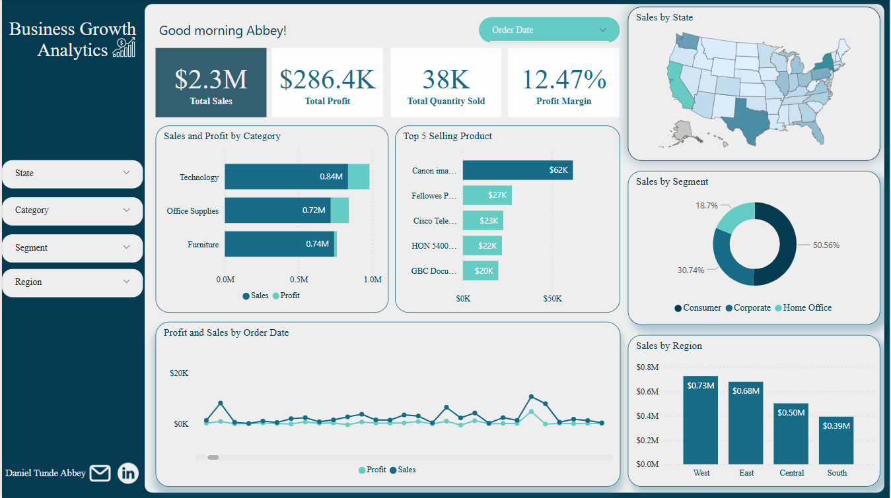
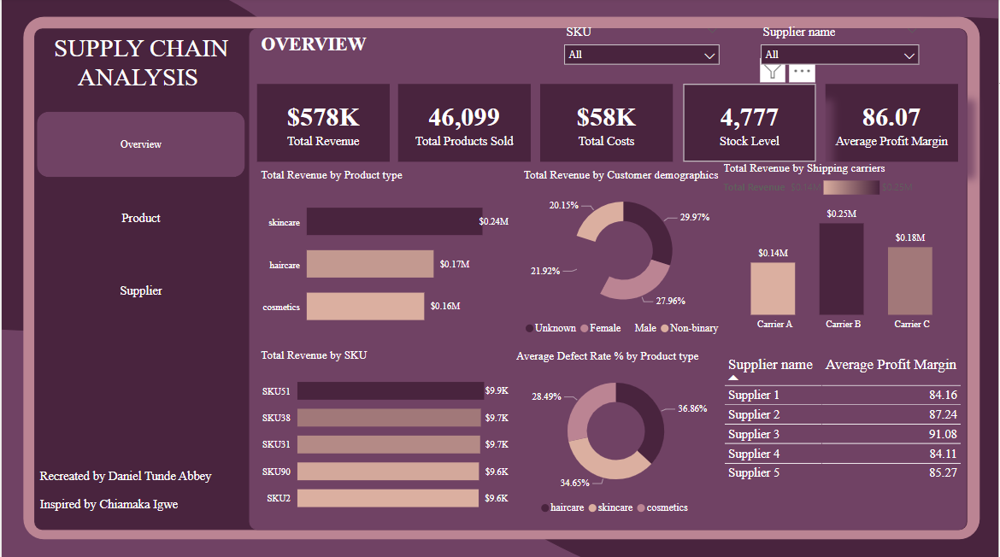
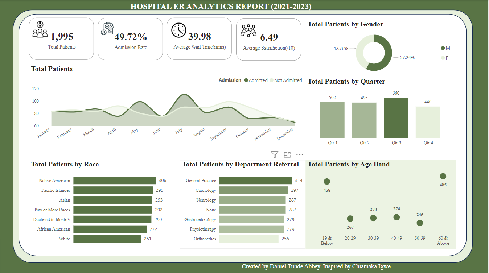

## ABOUT ME 
Hello! 👋 I’m Daniel Tunde Abbey, a skilled Data Analyst dedicated to transforming data into actionable insights. I specialize in data collection, analysis, and visualization, leveraging tools like Excel, Power BI, Tableau, and Python to uncover trends and support data-driven decisions. I have honed my ability to work across various industries, delivering impactful results in projects. I am committed to continuous learning and applying innovative solutions to solve real-world problems through data.

Feel free to reach out—let’s explore the world of data together! 🌟, 

## SKILLS
**Technical Skills**  
- **Data Analysis & Cleaning**: Python, SQL, Excel  
- **Data Visualization**: Power BI, Tableau, Matplotlib, Seaborn  
- **Database Management**: MySQL

**Soft Skills**  
- **Problem-Solving and Critical Thinking**  
- **Attention to Detail**  
- **Communication and Storytelling with Data**  
- **Time Management and Organizational Skills**  
- **Team Collaboration and Stakeholder Engagement**  

## MY PROJECTS
*Showcasing a collection of data-driven projects highlighting my expertise in data analysis, visualization, and storytelling using tools like Python, Power BI, Tableau, and Excel.*

**Business Growth Analytics Report**

The Business Growth Analytics Dashboard was an interactive visualization tool designed to track key sales and profitability metrics. It provided insights into total sales, profit margins, top-performing products, and sales distribution by category, region, and customer segment. 

[Read More]()

[Interact with the dashboard here]()

**Annual Financial Analysis Dashboard**

Analyzed and visualized yearly financial data, highlighting revenue, expenses, and profit trends to support strategic decision-making.

[Read More](https://github.com/Daniel-Tunde-Abbey/Annual-Financial-Records-Analysis)

[Interact with the dashboard here](https://app.powerbi.com/links/npYppGqAtW?ctid=f73bbd3e-2c86-40d1-8fff-d2c041f1c075&pbi_source=linkShare)

**Customer Feedback Analysis Dashboard**

Developed an interactive dashboard to analyze customer sentiment, satisfaction trends, and actionable insights for improved service delivery.

[Read More](https://github.com/Daniel-Tunde-Abbey/Customer-Feedback-Analysis-Dashboard)

[Interact with the dashboard here](https://1drv.ms/x/c/81a758a4a49cfbb0/ERzxBBuVhMBIh7bY21f5MN0B1GbCT60BQaUNeYNP84UuYQ?e=Yp0H2p)

**Supply Chain Analysis Dashboard**

The Supply Chain Analysis Dashboard was designed to provide a comprehensive overview of critical supply chain metrics, including total revenue, product sales, stock levels, costs, and profit margins. It was reported that businesses could use this dashboard to track revenue distribution across product types, assess supplier performance, analyze customer demographics, and evaluate shipping carrier contributions. 

[Read More](https://github.com/Daniel-Tunde-Abbey/Supply-Chain-Analysis-Dashboard)

[Interact with the dashboard here](https://app.powerbi.com/links/cHyto1e900?ctid=f73bbd3e-2c86-40d1-8fff-d2c041f1c075&pbi_source=linkShare)

**Sales and Revenue Analysis Dashboard**

Created a comprehensive dashboard showcasing sales performance, revenue growth, and product metrics across regions and customer segments.

[Read More](https://github.com/Daniel-Tunde-Abbey/Sales-and-Revenue-Analysis-Dashboard)

[Interact with the dashboard here](https://1drv.ms/x/c/81a758a4a49cfbb0/EV7Fi9VVn-FNjb1MCQ1_Eb4BUqCuwC-UW9MnGuV93MZn5Q?e=g0TKNg)

**Hospital ER Analytics Report**

The Hospital ER Dashboard was created to offer real-time insights into emergency room operations, enabling hospital administrators to manage patient flow, track wait times, and monitor key performance indicators such as admission rates, patient demographics, and resource allocation. 

[Read More](https://github.com/Daniel-Tunde-Abbey/Hospital-ER-Analytics-Report)

[Interact with the dashboard here](https://app.powerbi.com/links/4PxbhKhQF9?ctid=f73bbd3e-2c86-40d1-8fff-d2c041f1c075&pbi_source=linkShare)

**Executive Summary Finance Report**

Compiled key financial metrics into a concise report, providing stakeholders with an overview of performance through clear and impactful visualizations.

[Read More](https://github.com/Daniel-Tunde-Abbey/Executive-Summary-Finance-Report)

[Interact with the dashboard here](https://app.powerbi.com/links/sIuaSHhriF?ctid=f73bbd3e-2c86-40d1-8fff-d2c041f1c075&pbi_source=linkShare)

## CONTACT DETAILS

*Let’s connect and see how we can make a difference together!*
<table>
  <tbody>
    <tr> 
      <td>📧</td>
      <td><a href="mailto:danielabbey020@gmail.com">danielabbey020@gmail.com</a></td>
    </tr>
    <tr>
      <td>📞</td>
      <td>(234) 706-622-403-8</td>
    </tr>
    <tr>
      <td>📍</td>
      <td>Kano, Nigeria</td>    
    </tr>
    <tr>
      <td>⬇️</td>
      <td><a href="Daniel Tunde Abbey Resume.pdf">My Resume</a></td>
    </tr>
    <tr>
      <td>🌐</td>
       <td><a href="https://linkedin.com/in/daniel-tunde-abbey-8a5479261">Check me out on LinkedIn</a></td>
  </tbody>
</table>
