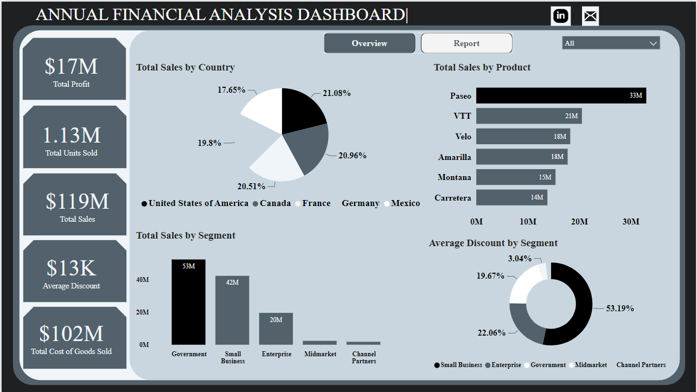
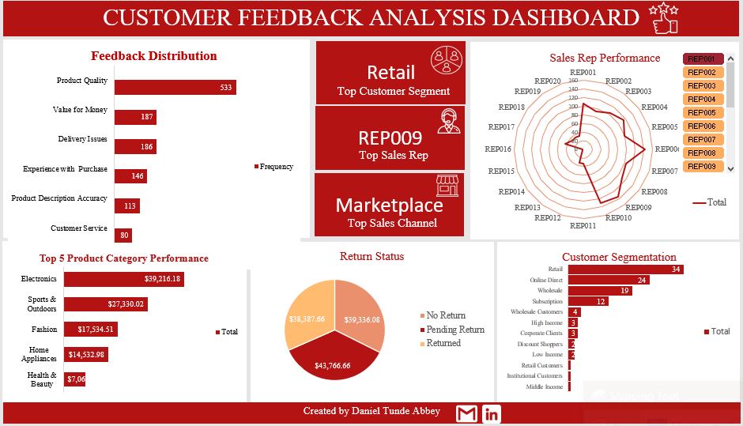
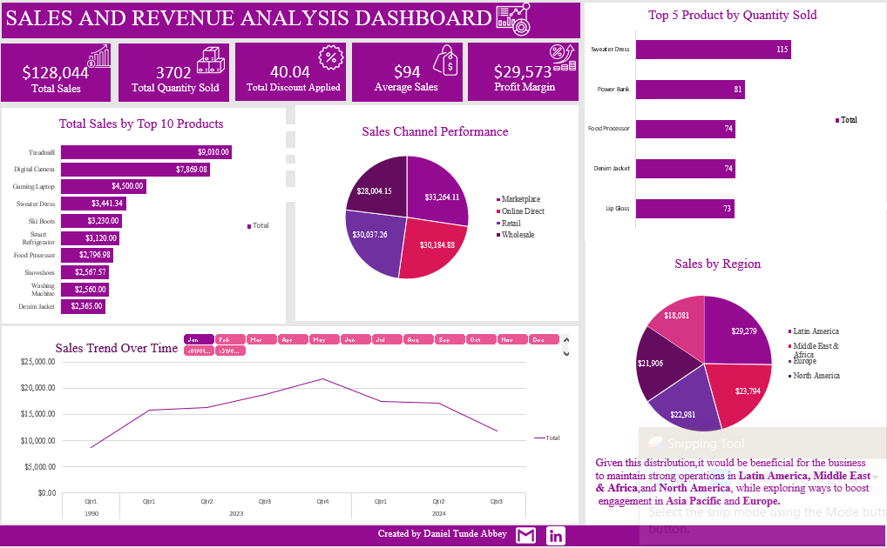
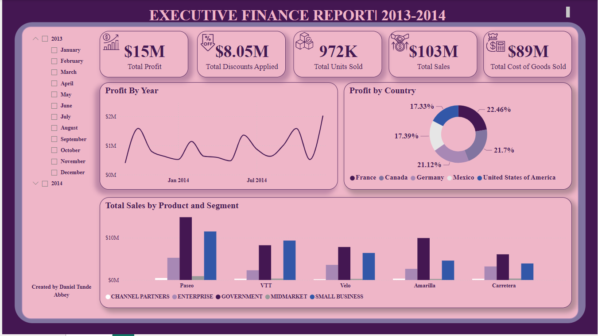

## ABOUT ME 
Hello! 👋 I’m Daniel Tunde Abbey, a skilled Data Analyst dedicated to transforming data into actionable insights. I specialize in data collection, analysis, and visualization, leveraging tools like Excel, Power BI, Tableau, and Python to uncover trends and support data-driven decisions. I have honed my ability to work across various industries, delivering impactful results in projects. I am committed to continuous learning and applying innovative solutions to solve real-world problems through data.

Feel free to reach out—let’s explore the world of data together! 🌟, 

## SKILLS
**Technical Skills**  
- **Data Analysis & Cleaning**: Python, SQL, Excel  
- **Data Visualization**: Power BI, Tableau, Matplotlib, Seaborn  
- **Statistical Analysis**: Hypothesis testing, regression, descriptive statistics  
- **Database Management**: MySQL, PostgreSQL

**Soft Skills**  
- **Problem-Solving and Critical Thinking**  
- **Attention to Detail**  
- **Communication and Storytelling with Data**  
- **Time Management and Organizational Skills**  
- **Team Collaboration and Stakeholder Engagement**  

## MY PROJECTS
*Showcasing a collection of data-driven projects highlighting my expertise in data analysis, visualization, and storytelling using tools like Python, Power BI, Tableau, and Excel.*

**Annual Financial Analysis Dashboard**

Analyzed and visualized yearly financial data, highlighting revenue, expenses, and profit trends to support strategic decision-making.
[Interact with the dashboard here]

**Customer Feedback Analysis Dashboard**

Developed an interactive dashboard to analyze customer sentiment, satisfaction trends, and actionable insights for improved service delivery.
[Interact with the dashboard here]

**Sales and Revenue Analysis Dashboard**

Created a comprehensive dashboard showcasing sales performance, revenue growth, and product metrics across regions and customer segments.
[Interact with the dashboard here]

**Executive Summary Finance Report**

Compiled key financial metrics into a concise report, providing stakeholders with an overview of performance through clear and impactful visualizations.
[Interact with the dashboard here]
